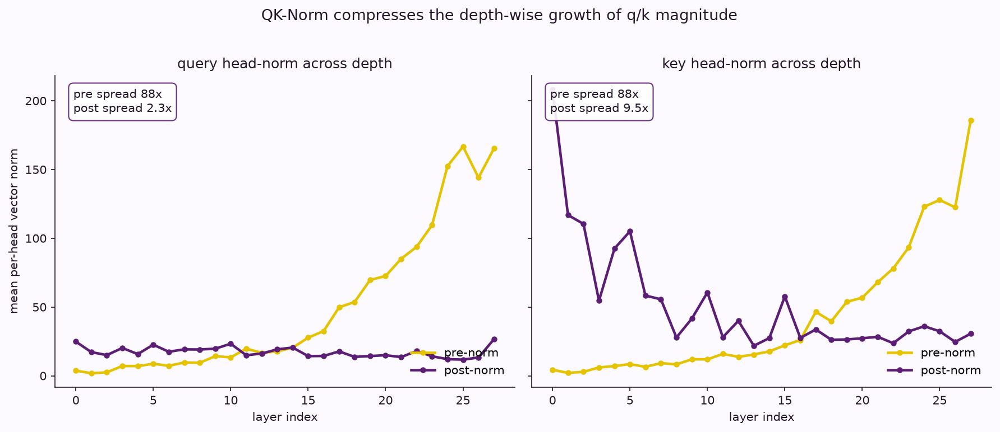

# qwen3-qk-norm

Qwen3 adds a normalization step to attention that its Llama-family predecessors
do not have: the query and key vectors are RMS-normalized, per head, immediately
before the rotary embedding and the attention dot product. This repository works
out what that step does, from first principles and against a real Qwen3-0.6B
forward pass.

The claims here are measured, not asserted. Every number comes from
instrumenting the actual model, and the from-scratch derivation of RMSNorm is
proven numerically identical to the implementation the model runs.

## The finding in one figure



Without normalization, the per-head magnitude of the query and key vectors grows
monotonically with depth, spreading by roughly a factor of 88 across Qwen3-0.6B's
28 layers. QK-Norm compresses that to about 2.3x for queries. Keys stay looser,
around 9.5x, because the query and key normalizers have separate learned weights
and the key normalizer's weight is larger.

Because the attention logit is a dot product of query and key, bounding their
norms bounds the logit. The largest attention logit across all 28 layers, over a
4096-token sequence, is a rounding error against the FP16 ceiling. The overflow
that QK-Norm is often said to prevent does not occur here precisely because the
normalization is present: the causal chain from large pre-norm magnitude, to
small post-norm magnitude, to small logits, is contained entirely in the model's
own data.

## What is in here

- **`qk_norms_notebook.ipynb`** is the write-up. It moves from an intuition for
  where the normalization sits, through the measured effect on a real forward
  pass, to a from-scratch derivation of RMSNorm checked against the model's own
  implementation, and finally to the concrete tensor shapes the operation runs
  on. It ships with its outputs rendered, so it can be read without running
  anything.
- **`scripts/rmsnorm_mechanism.py`** derives RMSNorm explicitly and proves the
  derivation equals `Qwen3RMSNorm` on random weights. It also demonstrates the
  two properties the derivation exposes: normalization is independent per head,
  and RMSNorm is invariant to per-head scale, so what survives normalization is
  direction rather than magnitude.
- **`scripts/capture_qk_stats.py`** is the instrumentation. It hooks `q_norm`
  and `k_norm` on a real Qwen3-0.6B, records pre- and post-norm statistics and
  post-RoPE attention logits, and writes them to `results/qk_stats.json`. A
  drift guard verifies the model's attention block still matches the structure
  the analysis assumes, and fails loudly if a future transformers version
  changes it.

## Reproducing the numbers

The captured statistics are not committed, so regenerate them before running the
plots or the notebook's capture-backed cells:

```bash
python scripts/capture_qk_stats.py   # writes results/qk_stats.json
```

This loads Qwen3-0.6B and runs two passes: 200 pooled MMLU-Redux prompts for the
distribution, and one continuous 4096-token document for the position-wise view.
It runs on CPU. The long-sequence pass is the memory-heavy half; it processes one
layer at a time and chunks the logit computation so it fits in 16 GB.

Then run `qk_norms_notebook.ipynb` top to bottom to execute the glass-box cells
against the captured data. The figures in `assets/` are committed, so the
notebook can also be read as-is without regenerating anything.

## Requirements

- `torch`
- `transformers` (with Qwen3 support)
- `datasets`
- `matplotlib`, `numpy`

The capture step downloads Qwen3-0.6B on first run. The equivalence proof in
`rmsnorm_mechanism.py` and the shape guard in `capture_qk_stats.py` need no
weights: they build the relevant modules directly.

## Notes on method

The derivation is kept separate from the measurement. RMSNorm is worked out in
full before any measured number is stated, and the number that would motivate
the derivation the wrong way round, the overflow figure, is presented as
evidence the mechanism works rather than as its justification. The float32 cast
inside RMSNorm is treated as load-bearing: a from-scratch version that stays in
the input dtype diverges on half precision, and the equivalence proof would catch
it.